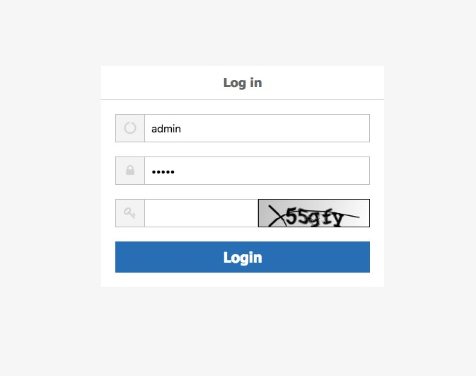

## Introduction
y-sso 是一个分布式、restful 风格单点登录框架.

> tips: 项目还在开发中


## 特点

1. 基于注解实现权限
2、基于restful 风格，纯前后分离


## TODO
 

* [x] 完成前端登录页面(对跳转到的登录网页在登录成功之后，进行返回之前的页面）
* [ ] demo
* [ ] get start


***

## screen



## API


	- http://example.com:8888/ysso/api/1/captcha [POST, GET]
	- http://example.com:8888/ysso/api/1/user [POST, GET,PUT,DELETE]

### /ysso/api/1/captcha
获得验证码的接口

Methods
***

**`POST`**
**/ysso/api/1/captcha**

post 的方式获得验证码

**请求参数**

> 无参数


**`GET`**
**/ysso/api/1/captcha**

get 的方式获得验证码

**请求参数**

> 无参数

### /ysso/api/1/user
用户登录的接口

Methods
***

**`POST`**
**/ysso/api/1/user?username&password&captcha&isKeep**

用户登录需要验证码,同时如果某个点需要在本机器免登录，各个节点也都免登录.

**请求参数**

| parameter | value | description |
| :-: | :-: | :-: |
| username | String | 用户名字 |
| password | String | 用户密码 |
| captcha | String | 验证码 |
| isKeep | String[Boolean] | 是否在本机免登录, 其他单点登录点也免登录 |

**返回-application/json**

- success

```json
{
    "status": 20000,
    "msg": "登陆成功"
}
```
- error

```json
{
    "status": 40000,
    "msg": "请输入验证码|请确认用户名和密码"
}
```


**`GET`**

**/ysso/api/1/user**

获得用户信息，需要用户登录情况下

**请求参数**

> 无参

**返回-application/json**

- success

```json
{
    "status": 20000,
    "data": {
        "id": 1,
        "username": "admin",
        "password": ""
    }
}
```

- error

```json
{
    "status": 40100,
    "msg": "用户未登入"
}
```

**`PUT`**

**/ysso/api/1/user?password**
修改用户信息，需要用户登录情况下, 更新密码之后，强制登录

**请求参数**

| parameter | value | description |
| :-: | :-: | :-: |
| password | String | 修改密码 |


**返回-application/json**

- success

```json
{
    "status": 20000,
    "msg": "登陆成功"
}
```

- error

```json
{
    "status": 40000,
    "msg": "更新密码失败"
}
{
    "status": 40100,
    "msg": "用户未登录"
}
```


**`DETELE`**

**/ysso/api/1/user**

用户退出，不管是否登录，退出成功之后，都强制登录

**请求参数**

> 无参


**返回-application/json**

- success

```json
{
    "status": 40100,
    "msg": "退出成功"
}
```

- error

```json
{
    "status": 40100,
    "msg": "用户未登入"
}
```


